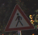
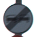
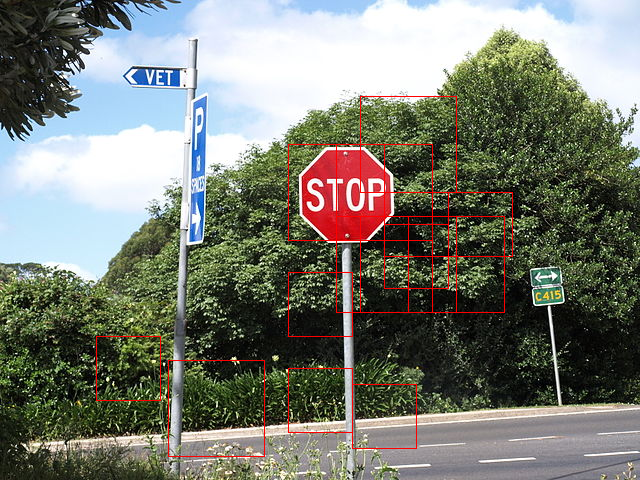
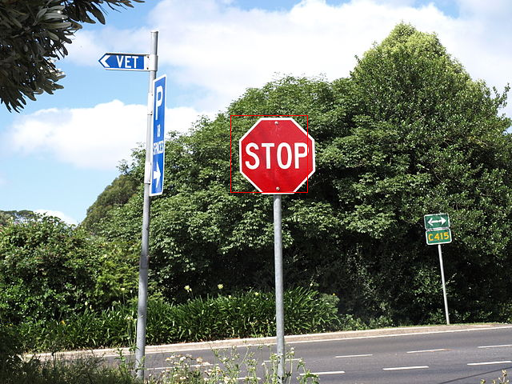

# BNN on Pynq

这个notebook展示了如何在Pynq上使用二值化神经网络。它展示了使用BNN做图像识别的例子，该网络基于VGG-16，包含6层卷积层，3层池化层以及3层全连接层。

## 1. 实例化分类器

创建一个分类器将会自动下载对应的比特流到FPGA设备中，并且加载对应的训练好的特定数据集的权重。默认情况下我们会加载CNV网络，使用1bit的权重值和1bit的激活值-这个例子使用德国路标数据集。


```python
import bnn
print(bnn.available_params(bnn.NETWORK_CNVW1A1))

classifier = bnn.CnvClassifier(bnn.NETWORK_CNVW1A1, 'road-signs', bnn.RUNTIME_HW)
```


    ['road-signs', 'streetview', 'cifar10']


## 2. 罗列可用的分类类别
选定的数据集有42个分类选项，我们可以通过分类器实例获取到它们的名称


```python
print(classifier.classes)
```

    ['20 Km/h', '30 Km/h', '50 Km/h', '60 Km/h', '70 Km/h', '80 Km/h', 'End 80 Km/h', '100 Km/h', '120 Km/h', 'No overtaking', 'No overtaking for large trucks', 'Priority crossroad', 'Priority road', 'Give way', 'Stop', 'No vehicles', 'Prohibited for vehicles with a permitted gross weight over 3.5t including their trailers, and for tractors except passenger cars and buses', 'No entry for vehicular traffic', 'Danger Ahead', 'Bend to left', 'Bend to right', 'Double bend (first to left)', 'Uneven road', 'Road slippery when wet or dirty', 'Road narrows (right)', 'Road works', 'Traffic signals', 'Pedestrians in road ahead', 'Children crossing ahead', 'Bicycles prohibited', 'Risk of snow or ice', 'Wild animals', 'End of all speed and overtaking restrictions', 'Turn right ahead', 'Turn left ahead', 'Ahead only', 'Ahead or right only', 'Ahead or left only', 'Pass by on right', 'Pass by on left', 'Roundabout', 'End of no-overtaking zone', 'End of no-overtaking zone for vehicles with a permitted gross weight over 3.5t including their trailers, and for tractors except passenger cars and buses']


## 3. 获取要被分类的图片


```python
from PIL import Image
import numpy as np
from os import listdir
from os.path import isfile, join
from IPython.display import display

imgList = [f for f in listdir("/home/xilinx/jupyter_notebooks/bnn/pictures/road_signs/") if isfile(join("/home/xilinx/jupyter_notebooks/bnn/pictures/road_signs/", f))]

images = []
   
for imgFile in imgList:
	img = Image.open("/home/xilinx/jupyter_notebooks/bnn/pictures/road_signs/" + imgFile)
	images.append(img)    
	img.thumbnail((64, 64), Image.ANTIALIAS)
	display(img) 
  
```








## 4. 在硬件中运行BNN
图片将会被传输到FPGA中，然后在硬件中进行逻辑推理。这个图片将会被自动裁剪到合适CNV网络的Cifar-10格式。


```python
results = classifier.classify_images(images)
print("Identified classes: {0}".format(results))
for index in results:
    print("Identified class name: {0}".format((classifier.class_name(index))))
```

    Inference took 2744.00 microseconds, 914.67 usec per image
    Classification rate: 1093.29 images per second
    Identified classes: [14 27 41]
    Identified class name: Stop
    Identified class name: Pedestrians in road ahead
    Identified class name: End of no-overtaking zone


## 5. 在软件中运行BNN
使用同样的图片在ARM核中用软件进行推理，传入RUNTIME_SE参数即可。


```python
sw_class = bnn.CnvClassifier(bnn.NETWORK_CNVW1A1,"road-signs", bnn.RUNTIME_SW)

results = sw_class.classify_images(images)
print("Identified classes: {0}".format(results))
for index in results:
    print("Identified class name: {0}".format((classifier.class_name(index))))
```

    Inference took 4918608.00 microseconds, 1639536.00 usec per image
    Classification rate: 0.61 images per second
    Identified classes: [14 27 41]
    Identified class name: Stop
    Identified class name: Pedestrians in road ahead
    Identified class name: End of no-overtaking zone


## 6. 在场景中定位物体

这个例子将会从单张输入图片中创建一个图片矩阵，并在其中尝试去定位物体。这张图片展示了道路十字路口，我们希望能在其中发现STOP标记牌。


```python
from PIL import Image
image_file = "/home/xilinx/jupyter_notebooks/bnn/pictures/street_with_stop.JPG"
im = Image.open(image_file)
im
```


下面我们将会对整个图片矩阵进行一次分类，并且展示所有被识别为STOP标记牌的子图片


```python
images = []
bounds = []
for s in [64,96]:
    stride = s // 4
    x_tiles = im.width // stride
    y_tiles = im.height // stride
    
    for j in range(y_tiles):
        for i in range(x_tiles):
            bound = (stride * i, stride * j, stride * i + s, stride * j + s)
            if bound[2] <= im.width and bound[3] < im.height:
                c = im.crop(bound)
                images.append(c)
                bounds.append(bound)

print(len(images))
```

    1330


```python
results = classifier.classify_images(images)
stop = results == 14
indicies = []
indicies = stop.nonzero()[0]
from PIL import ImageDraw
im2 = Image.open(image_file)
draw2 = ImageDraw.Draw(im2)
for i in indicies:
    draw2.rectangle(bounds[i], outline='red')

im2
```

    Inference took 437596.99 microseconds, 329.02 usec per image
    Classification rate: 3039.33 images per second





上面的处理结果干扰结果太多，我们将会设定一定的阈值来过滤一下


```python
result = classifier.classify_images_details(images)
result=result.reshape(len(images),43)
from PIL import ImageDraw

draw = ImageDraw.Draw(im)
i=0
for image in images:
    if result[i][14] > 370:
        draw.rectangle(bounds[i], outline='red')
    i=i+1    
    
im
```

    Inference took 437603.00 microseconds, 329.02 usec per image
    Classification rate: 3039.28 images per second





## 7. 请一定要复位


```python
from pynq import Xlnk

xlnk = Xlnk();
xlnk.xlnk_reset()
```
