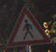
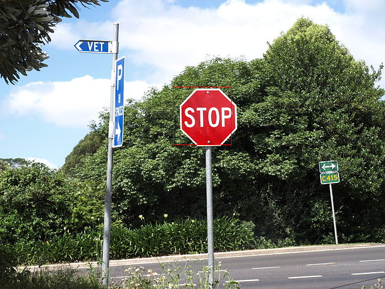

<h1 align=center>零基础十分钟开发自己的AI</h1>


规则：十分钟之内根据老师的指导，在PYNQ-Z2开发板上独立完成AI应用的开发或者算法的加速。

| 活动时间（报名制，准点开课） |
| :--------------------------: |
|         10:30-10:45          |
|         11:30-11:45          |
|         14:30-14:45          |
|         16:30-16:45          |


在本教程的带领下，你将在十分钟内学会在PYNQ-Z2板卡上使用二值化神经网络开发自己的AI应用！

## 1. AI初学者入门第一步：分类

AI入门第一步就是对输入的图片进行分类。首先我们需要初始化一个分类器，根据最终实现分类目标的不同需要选择不同的数据集。我们可以在‘road-signs','streeview'和‘cifar10’三个数据集中选择其一，这里选择的是'road-signs'交通标志数据集。


```python
import bnn
print(bnn.available_params(bnn.NETWORK_CNVW1A1))

classifier = bnn.CnvClassifier(bnn.NETWORK_CNVW1A1, 'road-signs', bnn.RUNTIME_HW)
```

    ['road-signs', 'streetview', 'cifar10']


## 2. 一个“训练好”的分类器可以识别多少种目标呢？
我们上面选择的'road-signs'数据集可以识别42种不同的路标标记


```python
print(classifier.classes)
```

    ['20 Km/h', '30 Km/h', '50 Km/h', '60 Km/h', '70 Km/h', '80 Km/h', 'End 80 Km/h', '100 Km/h', '120 Km/h', 'No overtaking', 'No overtaking for large trucks', 'Priority crossroad', 'Priority road', 'Give way', 'Stop', 'No vehicles', 'Prohibited for vehicles with a permitted gross weight over 3.5t including their trailers, and for tractors except passenger cars and buses', 'No entry for vehicular traffic', 'Danger Ahead', 'Bend to left', 'Bend to right', 'Double bend (first to left)', 'Uneven road', 'Road slippery when wet or dirty', 'Road narrows (right)', 'Road works', 'Traffic signals', 'Pedestrians in road ahead', 'Children crossing ahead', 'Bicycles prohibited', 'Risk of snow or ice', 'Wild animals', 'End of all speed and overtaking restrictions', 'Turn right ahead', 'Turn left ahead', 'Ahead only', 'Ahead or right only', 'Ahead or left only', 'Pass by on right', 'Pass by on left', 'Roundabout', 'End of no-overtaking zone', 'End of no-overtaking zone for vehicles with a permitted gross weight over 3.5t including their trailers, and for tractors except passenger cars and buses']


## 3. 接下来我们将用如下几张图片来测试刚刚选择的分类器


```python
from PIL import Image
import numpy as np
from os import listdir
from os.path import isfile, join
from IPython.display import display

imgList = [f for f in listdir("/home/xilinx/jupyter_notebooks/bnn/pictures/road_signs/") if isfile(join("/home/xilinx/jupyter_notebooks/bnn/pictures/road_signs/", f))]

images = []
for imgFile in imgList:
	img = Image.open("/home/xilinx/jupyter_notebooks/bnn/pictures/road_signs/" + imgFile)
	images.append(img)    
	img.thumbnail((64, 64), Image.ANTIALIAS)
	display(img) 
```





## 4. 在硬件中对运算进行加速

```python
results = classifier.classify_images(images)
print("Identified classes: {0}".format(results))
for index in results:
    print("Identified class name: {0}".format((classifier.class_name(index))))
```

    Inference took 2744.00 microseconds, 914.67 usec per image
    Classification rate: 1093.29 images per second
    Identified classes: [14 27 41]
    Identified class name: Stop
    Identified class name: Pedestrians in road ahead
    Identified class name: End of no-overtaking zone


## 5. 作为对比，我们也在软件层面进行一次上面的运算

```python
sw_class = bnn.CnvClassifier(bnn.NETWORK_CNVW1A1,"road-signs", bnn.RUNTIME_SW)

results = sw_class.classify_images(images)
print("Identified classes: {0}".format(results))
for index in results:
    print("Identified class name: {0}".format((classifier.class_name(index))))
```

    Inference took 4918608.00 microseconds, 1639536.00 usec per image
    Classification rate: 0.61 images per second
    Identified classes: [14 27 41]
    Identified class name: Stop
    Identified class name: Pedestrians in road ahead
    Identified class name: End of no-overtaking zone


## 6. AI初学者入门第二步：识别

如何才能在一大张图片中成功识别到某个具体的物体呢？如下图所示，我们如何从一张十字路口的照片中，识别到中间这个大大的STOP？


```python
from PIL import Image
image_file = "/home/xilinx/jupyter_notebooks/bnn/pictures/street_with_stop.JPG"
im = Image.open(image_file)
im
```


将一张大图片划分为许多张小图片，并对所有的小图片进行分类预测，就可以得出最有可能是STOP的位置


```python
images = []
bounds = []
for s in [64,96]:
    stride = s // 4
    x_tiles = im.width // stride
    y_tiles = im.height // stride
    for j in range(y_tiles):
        for i in range(x_tiles):
            bound = (stride * i, stride * j, stride * i + s, stride * j + s)
            if bound[2] <= im.width and bound[3] < im.height:
                c = im.crop(bound)
                images.append(c)
                bounds.append(bound)
print(len(images))

result = classifier.classify_images_details(images)
result=result.reshape(len(images),43)
from PIL import ImageDraw

draw = ImageDraw.Draw(im)
i=0
for image in images:
    # 设定一定的阈值
    if result[i][14] > 370:
        draw.rectangle(bounds[i], outline='red')
    i=i+1    
im
```

    1330
    Inference took 437603.00 microseconds, 329.02 usec per image
    Classification rate: 3039.28 images per second

